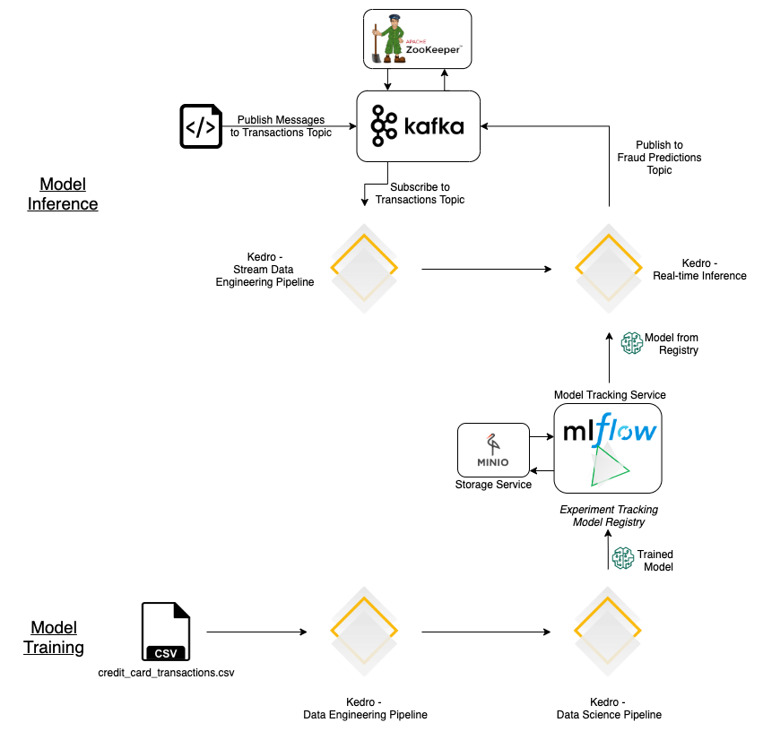

# Kedro-Streaming

## Overview

This repository serves as an introduction to Spark Streaming combined with Kedro. The infrastructure needed to enable
streaming has all been defined in [`docker-compose.yml`](docker-compose.yml).

There are two pipelines defined, emulating a real-life scenario:

- `kedro run --pipeline train` - This pipeline takes care of data engineering, training a ML model, publishing it to
  MLflow, and running validation.
- `kedro run --pipeline inference` - This pipeline is responsible for inference. It does data engineering on streaming
  data, loads the ML model from MLflow, and prints the outputted predictions as a stream to the console.
  A Kafka Topic can also be configured.

## Architecture



We use MinIO as an abstraction to a blob storage. Buckets that are defined here can be aliased to real S3 buckets for
production scenarios. For the MLflow metadata store, we use a MySQL server. Kafka is used to handle the streaming
architecture.

## Prerequisites

- A Docker installation, and basic understanding of Docker and microservices
- A high-level understanding of how Kedro pipelines work

## Step-by-step instructions

1. Clone this repository, and change the current directory to the root of the repository.

    ```bash
    git clone https://github.com/deepyaman/kedro-streaming.git
    cd kedro-streaming
    ```

2. Build the `mlflow_server` Docker image.

    ```bash
    docker build -t mlflow_server:latest -f Dockerfile.mlflow .
    ```

3. Start the multi-container application.

    ```bash
    docker-compose up
    ```

    **Services**

    | Service    | Host      | Port  |
    | ---------- | --------- | ----- |
    | Kafka      | localhost | 19092 |
    | MLflow     | localhost | 5000  |
    | Minio (S3) | localhost | 9000  |

4. In a new shell, create a conda environment, activate it, and install all Python dependencies.

    ```bash
    conda create -n kedro-streaming python=3.7 && conda activate kedro-streaming && pip install -e src/
    ```

5. Run the Kedro pipeline to train the model, and publish the model to the MLflow Model Registry.

    ```bash
    kedro run --pipeline train
    ```

6. Run the Kedro pipeline for spinning up the inference engine, which will do predictions on data, as it comes in.
   The `SparkStreamingDataSet` is defined to read from the `hello-fraud` Kafka topic. The pipeline is currently configured
   to print to the console. But various other
   [sinks](https://spark.apache.org/docs/latest/structured-streaming-programming-guide.html#output-sinks) can be defined.

    ```bash
    kedro run --pipeline inference
    ```

7. Now that you have the inference engine up, to test it, we need to produce some messages for the inference pipeline to
   consume in real-time. [notebooks/message_sender.ipynb](./notebooks/message_sender.ipynb) contains a sample of how
   messages can be produced, and sent to the defined `hello-fraud` Kafka topic.
